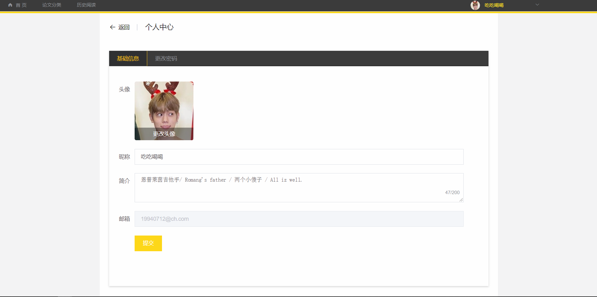

# 科研交流论坛 
## 毕设项目 
### 技术栈

1. 前端技术栈： vue.js + elementUI + axios + vuex + scss
2. 后端技术栈： Node.js + express + mongoose

### 实现效果

#### 登录注册

 
 
#### 个人中心

 
 
 
 
#### 论文分类

 
 
 
 
#### 论文详情

 
 
 
 
 

#### 论文阅读

 

